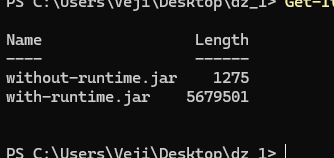
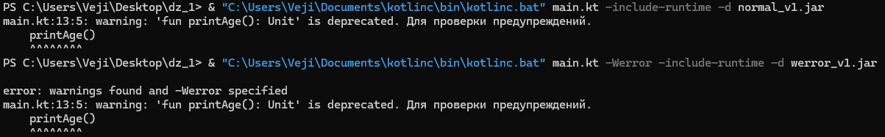

# DZ_1

## Код программы для компиляции

```kotlin
@Deprecated("Для проверки предупреждений")
fun printAge() {
    println("Введите ваше имя:")
    val name = readln()

    println("Введите ваш возраст: ")
    val age = readln().toInt()

    println("Пользователю, $name $age лет.")
}

fun main() {
    printAge()
}


```

## Компиляция

### Флаги

 - Флаг `-include-runtime` влияет на то, содержится ли в скомпилированном файле необходимые библиотеки

 - Флаг `-d` указывает куда поместить скомпилированный файл

 - Флаг `-verbose` выводит полную информацию о процессе компиляции

 - Флаг `-Werror` при компиляции, превращает предупреждения компиляции в ошибки

 ### Компиляция с разными флагами
Разница в размере скомпилированных файлов с и без флагом `-include-runtime`. В результате разница составила примерно 5 мегабайт.

 

 Разница в компиляции с флагом `-Werror` и без него

 

 В первом случае, было предупреждение, но файл скомпилировался, а во втором программа не была скомпилированна.